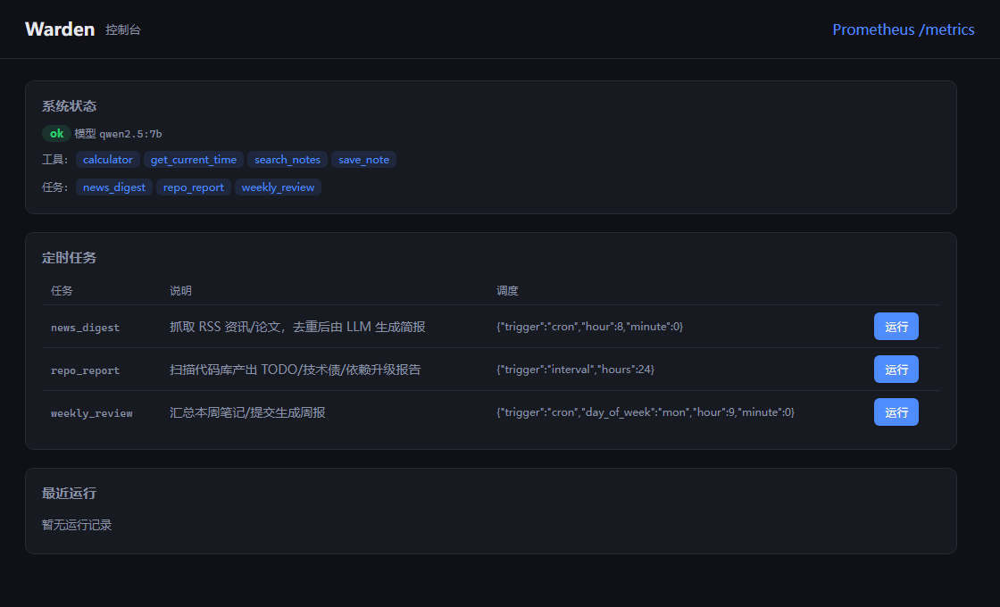
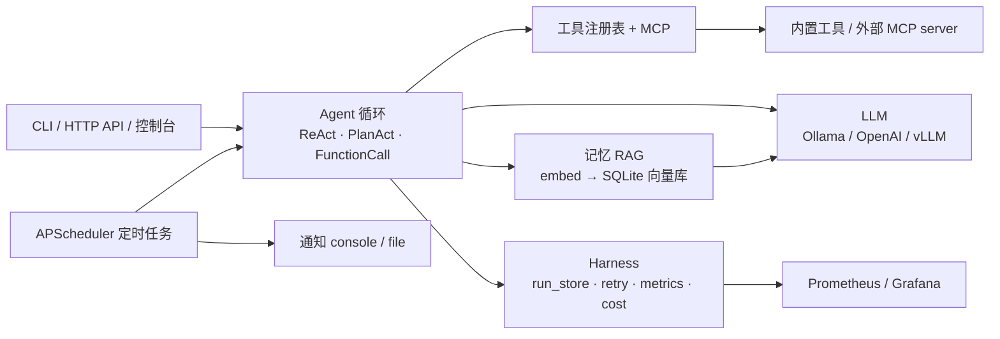

# Warden

[](https://github.com/nothing-4413/Warden/actions/workflows/ci.yml)
[](LICENSE)

自托管、长期运行的个人多智能体系统。



控制台是零构建的静态页面：系统状态、定时任务（可手动触发）、最近运行，右上角直达 Prometheus `/metrics`。

## 为什么做这个

- **数据不出网**：个人笔记、日程、代码库周报这类东西不想托管给第三方服务。Warden 默认指向本机 Ollama，除了你自己配置的 LLM/嵌入地址，不主动访问任何外部服务。
- **要的是「长期运行」而不是玩具 demo**：每次运行落 SQLite（`RunRecord`），崩了能 `resume` 续跑，重试幂等，指标可查。
- **个人项目的取舍**：够用优先。控制台是一个零构建的静态 HTML，向量检索是 SQLite 暴力余弦，不引入 LangChain / 向量数据库 / 消息队列。

## 架构



## 特性

- 自研 Agent 循环：ReAct / PlanAct / Function Calling（不依赖 LangChain）
- 轻量 Harness：状态持久化、断点续跑、重试/幂等、trace_id、Prometheus 指标
- 工具注册表 + MCP：pydantic 定义工具，插件化扩展，可接入外部 MCP server
- 记忆（RAG）：个人笔记嵌入 + 向量检索，读（`search_notes`）+ 写（`save_note`）闭环
- 多 Agent：路由 / 接力 / 共享黑板三种协作模式
- 定时任务：资讯简报、代码库维护、每周复盘
- LLM 可切换 OpenAI / Ollama / vLLM（OpenAI 兼容接口）

## 目录结构

```
Warden/
├── pyproject.toml
├── uv.lock                 # 依赖锁（uv lock 生成，CI 按它安装）
├── .env.example            # 环境变量示例（复制为 .env）
├── app/
│   ├── config.py           # 配置（pydantic-settings：环境变量 / .env，带类型校验）
│   ├── llm.py              # OpenAI 兼容 LLM 客户端（httpx 直连）
│   ├── schemas.py          # API 请求/响应模型
│   ├── main.py             # FastAPI 应用 + 路由
│   ├── cli.py              # python -m app.cli 命令行
│   ├── static/index.html   # 简单控制台（零构建）
│   ├── agent/              # Agent 循环 + 多 Agent 协作
│   │   ├── base.py         #   BaseAgent + 运行结果 + JSON 解析
│   │   ├── react.py        #   ReAct
│   │   ├── planact.py      #   PlanAct（Plan → Act → Summarize）
│   │   ├── function_call.py #  原生 Function Calling
│   │   ├── orchestrator.py #   路由编排
│   │   ├── pipeline.py     #   接力（researcher → critic）
│   │   └── blackboard.py   #   共享黑板
│   ├── tools/              # 工具注册表 + 内置工具
│   │   ├── base.py         #   Tool（输入/输出模型 + 执行超时）
│   │   ├── registry.py     #   注册表
│   │   └── builtin/        #   calculator / datetime / search_notes / save_note / blackboard
│   ├── memory/             # 记忆（RAG）：embeddings / vector_store / indexer / retriever
│   ├── mcp/                # MCP 客户端（stdio JSON-RPC + 工具适配）
│   ├── harness/            # trace / run_store / retry / metrics / cost
│   ├── scheduler/          # BaseTask + APScheduler 装配
│   ├── notify/             # 通知（console / file）
│   └── tasks/              # news_digest / repo_report / weekly_review
├── Dockerfile              # 应用镜像（可选）
├── docs/console.png        # 控制台截图（README 用）
├── scripts/                # 冒烟与评测脚本（纯标准库，可独立运行）
│   ├── smoke.py            #   真实 LLM 端到端冒烟
│   ├── eval_resume.py      #   崩溃恢复评测（跨进程 os._exit 注入）
│   ├── eval_retrieval.py   #   检索 Hit@K / MRR 评测
│   └── eval_router.py      #   把 chat / embeddings 两个本地实例拼成一个 base_url
├── deploy/                 # docker compose：应用 + Prometheus + Grafana
└── tests/                  # 单元测试（FakeLLM，零网络）
```

## 快速开始

```bash
# 1. 安装（Python 3.11+）
python -m venv .venv
.venv\Scripts\activate            # Windows；macOS/Linux: source .venv/bin/activate
pip install -e ".[dev]"           # 或：uv sync --locked --extra dev

# 2. 配置（默认指向本地 Ollama）
copy .env.example .env            # 按需改 WARDEN_LLM_*

# 3. CLI 对话
python -m app.cli chat "12 * 7 + 3 等于多少？"                # ReAct
python -m app.cli chat "现在几点了？" --agent planact
python -m app.cli chat "12 * 7 + 3 等于多少？" --agent function_call

# 4. 定时任务
python -m app.cli tasks            # 列出任务
python -m app.cli run news_digest  # 手动触发一次

# 5. 记忆（先在 .env 设 WARDEN_NOTES_DIR，并 ollama pull nomic-embed-text）
python -m app.cli index-notes
python -m app.cli search "上个月学了什么"

# 6. 多 Agent（先在 .env 配 WARDEN_MCP_SERVERS）
python -m app.cli mcp-ls
python -m app.cli team "帮我总结最近的论文进展"
python -m app.cli research "帮我查证 X 是否成立"
python -m app.cli collab "帮我查证 X 是否成立"

# 7. API
uvicorn app.main:app --reload
# 控制台 http://127.0.0.1:8000/ ；健康 /health ；对话 POST /api/v1/chat

# 8. 测试 / 真实 LLM 冒烟
pytest -q
python -m scripts.smoke
```

### Docker（可选）

一条命令起全栈（应用 + 监控）。镜像基于 `python:3.14-slim`，以非 root 用户运行，容器内跑 `uvicorn`：

```bash
cd deploy
docker compose up -d --build
# 控制台 http://localhost:8000 ；Prometheus http://localhost:9090 ；Grafana http://localhost:3000（admin / admin）
```

容器里的 `localhost` 指容器自身，因此 compose 把 `WARDEN_LLM_BASE_URL` 默认设为 `http://host.docker.internal:11434/v1`（连宿主机的 Ollama）；用远程 LLM 时在 shell 或 `deploy/.env` 里设同名变量即可覆盖。运行时数据落在 `warden-data` / `warden-reports` 两个命名卷里。

对话请求示例：

```bash
curl -X POST http://127.0.0.1:8000/api/v1/chat \
  -H "Content-Type: application/json" \
  -d '{"agent":"react","messages":[{"role":"user","content":"帮我算 12*7+3"}]}'
```

## 配置

复制 `.env.example` 为 `.env`。切换 LLM 只需改两个变量：

| 变量 | 默认 | 说明 |
|---|---|---|
| `WARDEN_LLM_BASE_URL` | `http://localhost:11434/v1` | OpenAI 兼容地址（Ollama / OpenAI / vLLM） |
| `WARDEN_LLM_MODEL` | `qwen2.5:7b` | 对话模型 |
| `WARDEN_EMBEDDING_MODEL` | `nomic-embed-text` | 嵌入模型（记忆检索用） |
| `WARDEN_NOTES_DIR` | 空 | 个人笔记目录（RAG 索引源） |
| `WARDEN_NOTIFY_KIND` | `console` | 任务通知方式：console / file |

其余开关（重试、超时、告警、查询改写/重排、自反思、自评等）见 `.env.example` 内注释。

## 设计要点

- **Agent 循环**：ReAct 输出单个 JSON（`{"action",...}` 或 `{"final_answer"}`），解析失败自纠重试、超步数强制收尾；PlanAct 先规划再确定性执行，工具失败可动态重规划（有上限）；Function Calling 走 OpenAI `tools` 协议原生 tool_calls。可选 Few-shot 注入、Reflexion-lite 自反思、self-eval 置信度自评。
- **Harness**：每次运行一条 `RunRecord`（id 即 trace_id，SQLite 持久化），`BaseAgent.run()` 断点可 `resume` 续跑；`with_retry` 指数退避；`/metrics` 暴露 runs/duration/token/cost 指标。
- **工具层**：新增工具 = 写一个 `Tool` + `register`，核心循环零改动。输入用 pydantic 校验并生成 JSON Schema；可选 `output_model` 输出校验、`timeout_s` 执行超时。
- **记忆**：笔记分块 → 嵌入 → SQLite 向量库暴力余弦检索。`search_notes` 读、`save_note` 写回，长期记忆闭环；可选查询改写 + LLM 重排两级检索增强。
- **多 Agent + MCP**：`Orchestrator` 路由到专家、`CriticPipeline` 接力（researcher → critic）、`BlackboardTeam` 共享黑板；MCP 客户端零依赖 stdio JSON-RPC，工具动态适配进注册表。
- **部署与监控**：`deploy/` 下 `docker compose up -d --build` 一把起应用(:8000) + Prometheus(:9090) + Grafana(:3000)，失败率告警（5 分钟窗口 error > 20%）。只想跑监控、应用在宿主机用 uvicorn 时：`docker compose up -d prometheus grafana`，并把 `deploy/prometheus/prometheus.yml` 的 target 改成 `host.docker.internal:8000`。

## 开发

```bash
pip install -e ".[dev]"        # pytest + pytest-cov + ruff

# 用 uv 时可以走锁文件（CI 就是这样装的，本地与 CI 版本一致）
uv sync --locked --extra dev   # 按 uv.lock 装到 .venv
uv run --no-sync pytest -q     # 后面的 python / pytest / ruff 也可加 uv run --no-sync
uv lock                        # 改过 pyproject.toml 依赖后刷新 uv.lock

ruff format .                  # 格式化（行宽 100）
ruff check --fix .             # lint（规则见 pyproject.toml）
pytest -q                      # 单元测试：FakeLLM，零网络
pytest -q --cov=app --cov-report=term-missing   # 覆盖率（当前基线 95%）
pytest -q -m "not live"        # 跳过实网回归（CI 用的就是这条）
pytest -q -m live              # 只跑实网回归（需 WARDEN_GATEWAY_E2E_URL）
```

CI（`.github/workflows/ci.yml`）跑三件事：ruff 格式与 lint（3.11，ruff 固定 0.16.10）、pytest + 覆盖率（3.11 / 3.14，依赖用 `uv sync --locked` 按 `uv.lock` 安装）、`docker build` 验证镜像能构建。`tests/test_gateway_live.py` 标了 `live`，需要真实 gateway，未设 `WARDEN_GATEWAY_E2E_URL` 时跳过。

> Windows：若 shell 的 `TEMP`/`TMP` 没指向系统临时目录，pytest 会把 `tmp_path` 目录建在仓库根目录，形成 `pytest-of-<用户>/`。已在 `.gitignore` 忽略（想彻底不产生，可给 pytest 加 `--basetemp=.pytest_tmp`，该目录同样已忽略）。
>
> Windows 上开了系统代理时：`httpx` 默认读注册表里的代理设置，连 `127.0.0.1` 的 Ollama 也会走代理（实测返回 502 且 body 为空，Ollama 侧看不到请求）。**Warden 自己已经处理**：`app/net.py` 判断目标是本机时对该次请求关掉环境代理（`trust_env=False`），指外网时仍沿用系统代理。第三方工具（curl、其它 SDK）不在此列，跑它们时可以设 `NO_PROXY=127.0.0.1,localhost`（清空 `HTTP_PROXY` 无效）。

## 评测

两个评测脚本都跑真实模型（不在 CI 里），产物写在 `data/eval/*.json`（`data/` 已忽略）。

```bash
# 前置：一个同时提供 /chat/completions 与 /embeddings 的 OpenAI 兼容端点
#   · 用 Ollama 最省事：ollama pull qwen2.5:7b nomic-embed-text，端点就是 http://127.0.0.1:11434/v1
#   · 用 llama.cpp 分两个进程跑时，用路由器把两者拼到一个端口：
#       llama-server -m <chat.gguf>  --port 11500 --alias qwen2.5-1.5b-instruct
#       llama-server -m <embed.gguf> --port 11501 --embeddings --pooling mean
#       python -m scripts.eval_router --port 11434 --chat http://127.0.0.1:11500 --embed http://127.0.0.1:11501

# 崩溃恢复：os._exit 硬崩后另起进程 resume，统计成功率与是否重复执行
python -m scripts.eval_resume --trials 30 --tasks a,b,c --out data/eval/resume.json

# 检索：自建中文标注语料（20 篇 × 40 条释义化查询），Hit@1/@3/@k + MRR
python -m scripts.eval_retrieval --k 4 --sweep 1,3,4,8 --out data/eval/retrieval-vector.json
python -m scripts.eval_retrieval --k 4 --compare --out data/eval/retrieval-compare.json
```

本机实测（CPU，qwen2.5-1.5b-instruct + nomic-embed-text-v1.5）：

| 项 | 结果 |
| --- | --- |
| 崩溃恢复 | **30/30 = 100%**（0 次被剔除）：3 种任务形态（单步计算、两步算术链、时间工具 + 计算器链）× 2 个崩溃深度（第一步落库后 / 链条中间），每次都在「已有一整步工具观测落库」时 `os._exit` 硬崩，另起进程 `resume()` 全部跑完，`answer` 正确且无重复步骤 |
| 检索（默认：纯向量） | Hit@1 42.5% / Hit@3 55.0% / Hit@4 65.0% / Hit@8 85.0%，MRR 0.538（k=8；k=4 时 0.508。Top-4 随机基线 20%） |
| 检索（改写 + 重排） | Hit@1 10.0% / Hit@4 60.0% / MRR 0.329 —— **本机小模型下是负收益**，所以这两项默认关闭（`WARDEN_RAG_REWRITE_ENABLED` / `WARDEN_RAG_RERANK_ENABLED`） |

延迟没有写进表里：它主要由本机 CPU 推理和转发开销决定，换台机器就变，不代表模型能力。

另有一个端到端冒烟脚本 `python -m scripts.smoke`：用真实模型依次跑 react / planact / function_call 三种循环、research（researcher → critic 接力）与 team 路由，任一环失败退出码非 0。本机实测 `ALL PASS`（react `12`、planact `3.0`、function_call `59`、research 与 team 都有非空答案）。

### 网关实网回归（可选）

`tests/test_gateway_live.py` 的 3 个用例打真实网关，默认整体跳过。本机用 InferGate 自带的最小栈验证过（`configs/agent-local.yaml`：网关 + 仓库内 mock 上游，幂等表与会话账本都在内存里）：

```bash
# InferGate 侧
bin/mockupstream.exe -listen 127.0.0.1:19910 -name mock
bin/infergate.exe -config configs/agent-local.yaml      # 网关监听 127.0.0.1:18909

# Warden 侧
export WARDEN_GATEWAY_E2E_URL=http://127.0.0.1:18909
export WARDEN_GATEWAY_E2E_MOCK=http://127.0.0.1:19910
python -m pytest tests/test_gateway_live.py -m live -q   # 3 passed
```

实测到的线路事实：两轮对话在账本里是同一条会话（`warden-<32 hex>`，等于对首条用户消息的确定性派生）；同一轮重发命中的是网关回放（`X-InferGate-Idempotent-Replay: true`、`upstream_name=replay`、28ms），mock 上游 `/calls` 计数不动（6 → 6）；`/v1/capabilities` 取回 `context_window=128000`、`max_output_tokens=4096`；账本 `requests=3 / ok=3 / failed=0 / idempotent_replays=1`。

## 路线图

- **M0 骨架** ✅ FastAPI + ReAct/PlanAct/Function Calling + 工具注册表
- **M1 动起来** ✅ APScheduler + 3 个定时任务 + 通知器
- **M2 Harness** ✅ 持久化 + 断点续跑 + 重试/幂等 + trace_id + 监控
- **M3 记忆** ✅ RAG over 个人笔记
- **M4 多 Agent + MCP** ✅ MCP 客户端 + 路由/接力/黑板
- **M5 打磨** ✅ 失败率告警 + 成本统计 + 简单控制台
- **M6 网关协同** ✅ InferGate 会话身份 + 幂等键 + capabilities 协商（`app/gateway/`）；评测脚本 `scripts/eval_resume.py`（崩溃恢复）、`scripts/eval_retrieval.py`（检索 Hit@K）
